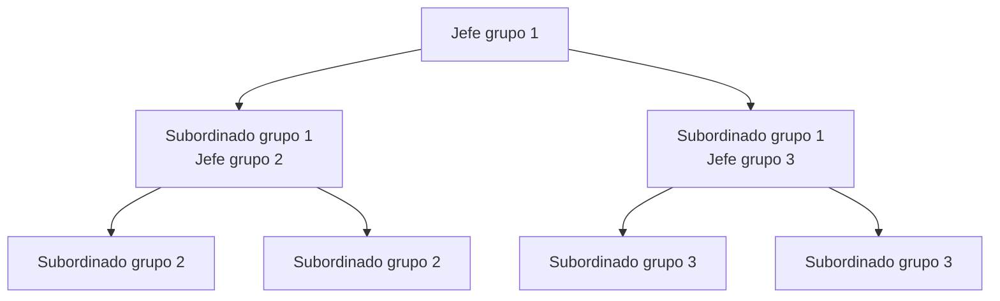

Actualmente, las [[jerarquías]] son el único [[sistemas circulares|tejido de cooperación]] de [[nivel de cooperación|nivel grupal]] capaz de sostenerse en [[escala de cooperación|grandes escalas]].

A diferencia del [[reconocimiento]], que requiere [[el reconocimiento no escala|vigilancia mutua]] entre los miembros de la comunidad, las jerarquías solo requieren que:
1. El jefe pueda vigilar a sus subordinados
2. El jefe pueda ordenar a los subordinados premiar o penalizar a otros individuos

Lo que vuelve escalables a las jerarquías es que estas pueden anidarse para formar estructuras escalonadas. Esto significa que el jefe de un grupo puede ser un subordinado en otro grupo. Esto puede dar lugar a estructuras piramidales:

Estas estructuras piramidales pueden ser arbitrariamente grandes. Existen límites a la escala, dados por las tecnologías de comunicaciones, de planificación y de rendimientos a la escala, pero no son límites intrínsecos de las jerarquías. En otras palabras, esos límites pueden moverse con el tiempo para dar lugar a jerarquías cada vez mayores.